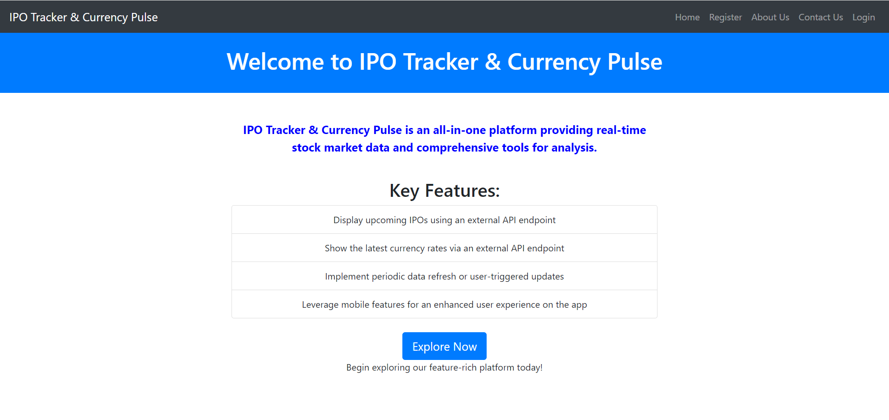

# IPO Tracker & Currency Pulse Dashboard

## Description

Welcome to the IPO Tracker & Currency Pulse Dashboard!. This application serves as a platform where users can access an Upcoming IPO Calendar and stay updated on the latest currency exchange rates. It provides real-time data on IPOs and currency rates. The app focuses on user-friendliness, offering clear information and intuitive navigation.

## Language : React 

## Project Links

- GitHub: [IPO Tracker & Currency Pulse Dashboard -Web Version (React)](https://github.com/saurabhkumarr99/Ipo-Tracker-Web)

- GitHub: [IPO Tracker & Currency Pulse Dashboard -App Version (React Native)](https://github.com/saurabhkumarr99/Stock-Market-Dashboard-App)

- Live: [IPO Tracker & Currency Pulse Dashboard -Web Version (React)](https://saurabhkumarr99.github.io/Host-Stock-Market-Web/)

- Live Expo Go Link: [IPO Tracker & Currency Pulse Dashboard -App Version (React Native)] (exp://u.expo.dev/update/12b2b67f-f49c-4b62-bd0e-ad5407f22dd1)

- Live Expo Go QR code: Scan the following QR code with an Android device to open it in Expo Go.

<p align="center">
  
</p>

## Table of Contents

- [Features](#features)
- [Getting Started](#getting-started)
- [Usage](#usage)
- [Components Structure](#components-structure)
- [Screenshots](#screenshots)
- [Author](#author)

## Features

- **User Authentication:** Incorporate user login and registration functionalities.
- **Upcoming IPO Calendar:** Display upcoming IPOs using an external API endpoint.
- **Currency Exchange Rates:** Show the latest currency rates via an external API endpoint.
- **Responsive Design:** Ensure complete functionality and responsiveness on both web and mobile.
- **User Dashboard:** Post-login, users can access a dashboard displaying IPOs and currency rates.
- **Data Refresh:** Implement periodic data refresh or user-triggered updates.
- **Mobile-Specific Features:** Leverage mobile features for an enhanced user experience on the app.


## Getting Started

### Prerequisites

- Node.js and npm (Node Package Manager) installed on your computer.
- Node.js: [Download and Install Node.js](https://nodejs.org/)

Follow these steps to run the Blog App locally:

1. **Unzip the IPO Tracker & Currency Pulse Dashboard App:**

2. **Navigate to the project directory:**

   ```bash
   cd StockMarketDashboardWeb
   ``` 

2. **Install Dependencies:**

   ```bash
   npm install
   ``` 


3. **Run:**

 - `Start Project`
   ```bash
      npm start
   ``` 

 - `Test Project`
   ```bash
      npm test
   ``` 

 - `Test Coverage`
   ```bash
      npm run coverage
   ``` 

- `Selenium Testing`

   Go to SeleniumTest folder and run -
   ```bash
      node LoginTest
   ``` 


## Usage

### Upcoming IPO Calendar

- **Explore Upcoming IPOs:** Access the application to view the calendar showcasing upcoming Initial Public Offerings (IPOs).
- **Stay Updated:** Stay informed about scheduled IPOs and related details for potential investment opportunities.
- **Track IPO Progress:** Monitor IPOs through the platform to track their performance and success rates.

### Currency Exchange Rates

- **Real-Time Currency Rates:** Utilize the app to check and monitor the latest currency exchange rates.
- **Compare Different Currencies:** Compare exchange rates between different currency pairs.
- **Currency Rate Analysis:** Use the provided data for currency rate analysis and informed decision-making.

## Code Structure

The project follows a structured directory layout for better organization:

- **allComponents/**
- **ScreenShots/**
- **App.js**
- **README.md**

## Screenshots

<p align="center">
   
   
   
   
   
   
   
   
   
   
   
   
      
</p>


- `Unit Test`
<p align="center">
  
  
</p

- `Coverage Test`
<p align="center">
  
  
  
</p


## Author

- SAURABH KUMAR RAI

